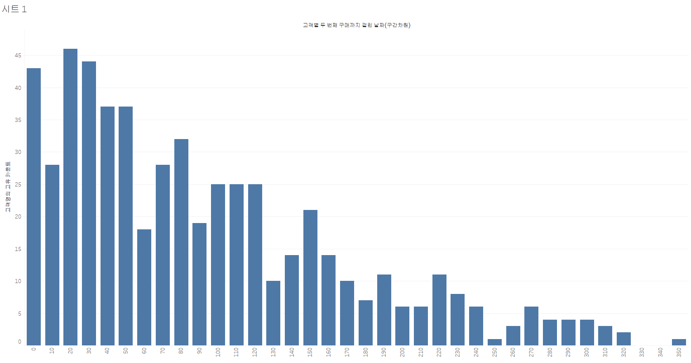
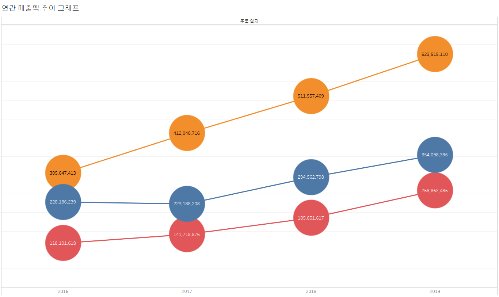
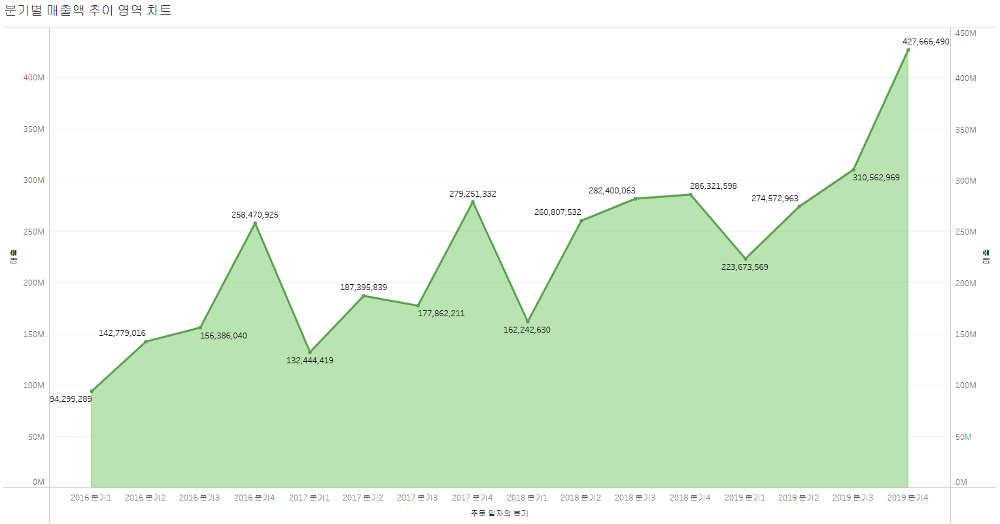
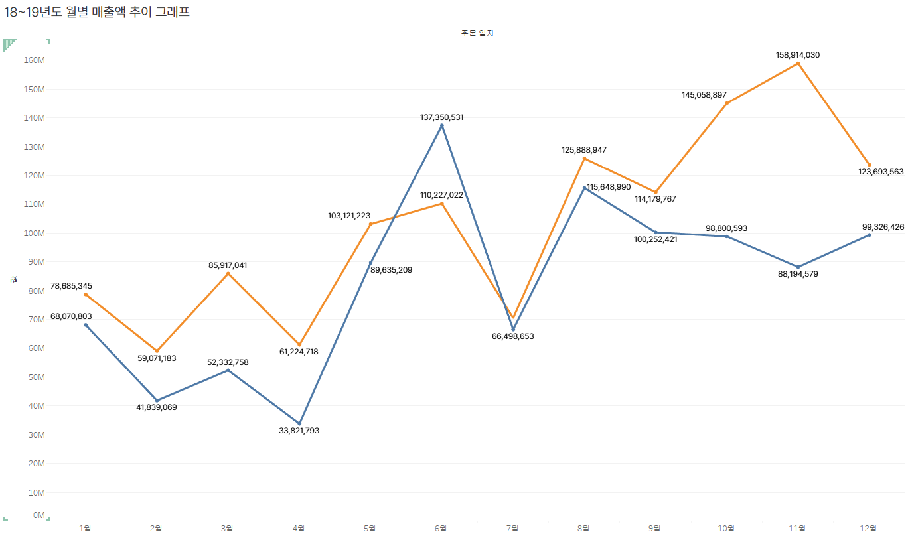

# 1. 고객별 재구매 시기 데이터 분석 태블로 시각화

이 그래프는 고객별 두 번째 구매까지 걸린 날짜(구간 단위)와 고객들의 교차 카운트를 나타냅니다.  
각 막대는 특정 구간에 해당하는 고객 수를 보여주며, 높이가 높을수록 그 구간에 해당하는 고객의 재구매 비율이 높은 것을 의미합니다.  
예를 들어, 그래프에서 100일 구간에 해당하는 막대는 고객들이 두 번째 구매까지 걸린 평균 기간이 100일임을 나타내며, 교차 카운트는 25명입니다.
 
# 2. 고객별 연간 매출액 추이 (선 그래프)

# 3. 고객 세그먼트별 연간 매출액 추이 (누적 막대 그래프)

# 4. 분기별 매출액 추이 (영역 차트 그래프)

# 5. 18~19년도 월별 매출액 추이 (선 그래프)

