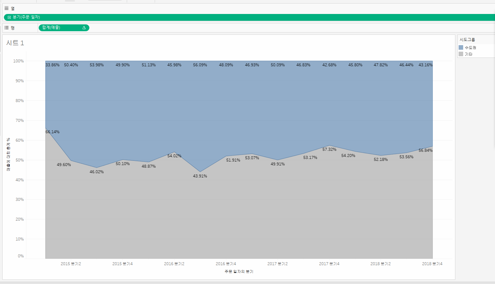

# 1. 고객별 재구매 시기 데이터 분석 태블로 시각화

이 그래프는 고객별 두 번째 구매까지 걸린 날짜(구간 단위)와 고객들의 교차 카운트를 나타냅니다.  
각 막대는 특정 구간에 해당하는 고객 수를 보여주며, 높이가 높을수록 그 구간에 해당하는 고객의 재구매 비율이 높은 것을 의미합니다.  
예를 들어, 그래프에서 100일 구간에 해당하는 막대는 고객들이 두 번째 구매까지 걸린 평균 기간이 100일임을 나타내며, 교차 카운트는 25명입니다.
 
# 2. 고객별 연간 매출액 추이 (선 그래프)

 
# 3. 고객 세그먼트별 연간 매출액 추이 (누적 막대 그래프)

 
# 4. 분기별 매출액 추이 (영역 차트 그래프)

 
# 5. 18~19년도 월별 매출액 추이 (선 그래프)

 
# 6. 라운드형 막대 그래프를  다음과 같이 지역별 매출액 합계

 
# 7. 평균라인이 있는 막대 그래프

 
# 8. 제품 계층 그래프

 
# 9.지도 그래프

 
# 10. 서울시 생활권 그래프

 
# 11. 수익 수량 비눗방울 그래프

 
# 12. 막대 라인 그래프

 
# 13. 지도 파이 그래프

 
# 14. 수도권과 기타 지역 매출 영역 그래프

 
# 15. 고객별 매출 순위 (상위 10위 / 상위 11 - 20위 / 상위 20위 )

# 16. 산포도 그래프

# 17. 트리맵 그래프

# 18. 대쉬보드 그래프

# 19. 차이 그래프

# 20. 2개의 라인 그래프

# 21. 라인 하이라이트 그래프

# 22. 챗지피티 이후 일자리의 변화

